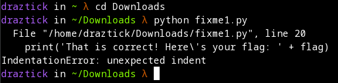
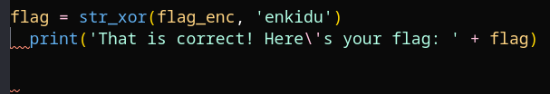

# fixme1.py

## Description

Fix the syntax error in this Python script to print the flag. Download Python script

## Prerequisites

Download the provided python script and ensure that python3 is correctly installed on the machine.

## Solution

Whenever solving python related issues, I like to begin by executing the script to see what the first error is. To do so, I execute:

```
python fixme1.py
```

This returns the following error:



Based on this output, I can tell that there is a formatting issue on the 20th line. In fact, openning this in an IDE or editor with linting available shows me where the issue is directly. Python is a whitespace dependent language and any deviation from expected whitespacing will cause an issue. Removing the space before the print statement on line 20 resolved the formatting issue and, upon re-execution of the script, returned the flag in plain text.

