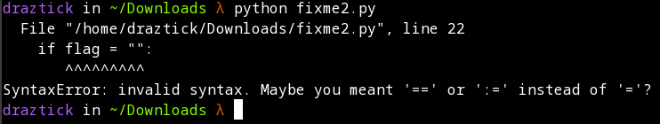

# fixme2.py

## Description

Fix the syntax error in the Python script to print the flag. Download Python script

## Prerequisites

Download the provided python script and ensure that python3 is correctly installed on the machine.

## Solution

Whenever solving python related issues, I like to begin by executing the script to see what the first error is. To do so, I execute:

```
python fixme2.py
```

This returns the following error:



This is a very clear error message that tells me exactly what the problem is. Instead of using the single equals sign, which is commonly associated with assigning a value to a variable, we need to use a double equals (==) as a comparitor between the two values. Once fixed and ran again, the plaintext flag is printed to screen and the problem is solved.