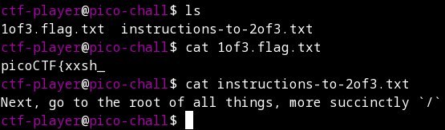
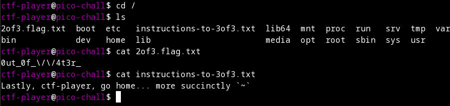

# Magikarp Ground Mission

## Description

Do you know how to move between directories and read files in the shell? Start the container, `ssh` to it, and then `ls` once connected to begin. Login via `ssh` as `ctf-player` with the password, `6d448c9c`

Additional details will be available after launching your challenge instance.

## Prerequisites

Be able to ssh from your system to an instance started during the setup of the problem.

## Solution

I first started the instance, as instructed by the problem description. I then use the information generated from the instance to log into the server. In my case this is:

```
ssh ctf-player@venus.picoctf.net -p 60318
```

Using the provided password, I am able to authenticate to the server. The first instruction, as stated in the description, is to issue an *ls* command. Doing so shows two different files, 1of3.flag.txt and instructions-to-2of3.txt. I note the contents of the former and read the latter.



Based on the instructions, I know I need to change directories into the root of the filesystem:

```
cd /
```

Issuing an *ls* command shows me two more files: 2of3.flag.txt and instructions-to-3of3.txt. I make a note of the former and read the latter.



Based on the instructions of the second instructions file, I know I need to issue another cd command and go to the home directory of the current user, whose shortcut is the tilde (~) key.

```
cd ~
```

Issuing an *ls* command reveals a single file containing the last part of the flag. Combining the three flag files together reveals the plaintext flag, completing the problem.