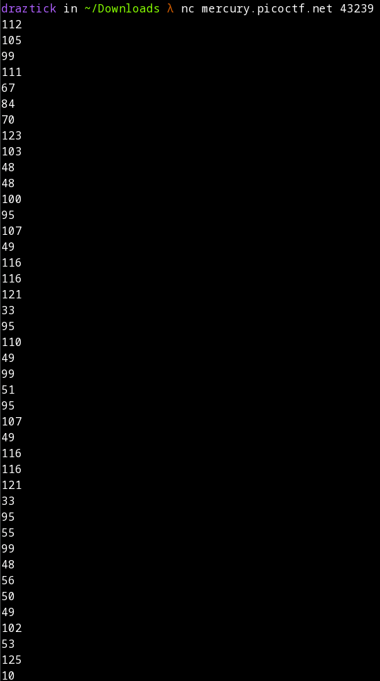
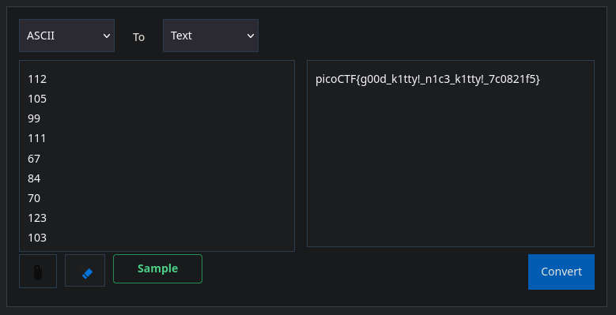

# Nice Netcat...

## Description

There is a nice program that you can talk to by using this command in a shell: $ nc mercury.picoctf.net 43239, but it doesn't speak English...

## Prerequisites

If you are using kali, you should have netcat installed by default. On other Linux distributions, you should be able to download netcat from your respective package manager. For Windows, the easiest way to get netcat is to install [Nmap](https://nmap.org/download.html) and use their special implementation called ncat.

Debian Linux

```
sudo apt install netcat
```
Fedora Linux

```
sudo dnf install netcat
```

## Solution

In order to get the information needed for the flag, I needed to connect to the target port on the target system using netcat. This outputs a bunch of numbers on new lines to the screen. When I look at the data, it is a bunch of whole numbers on new lines. Experience tells me that this is ASCII encoding, which assigns a number to letters, numbers, and symbols to create an encoding schema useful for transmitting data with a limit set of input.



Now, my instinct tells me to write a fancy python script, grab the data, and decode it all at once... but it is far easier to use an online ASCII -> Text [decoder](https://www.duplichecker.com/ascii-to-text.php). I copied the output of the netcat connection and pasted it, as is, into the online decoder. I then clicked the convert button to reveal the plaintext password.

