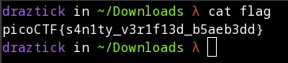

# Obedient Cat

## Description

This file has a flag in plain sight (aka "in-the-clear"). Download flag.

## Solution

The solution to this flag is pretty easy with a basic understanding of Linux commands. The best way to accomplish this via a Linux terminal is to issue the *cat* command followed by the file name. In this case the solution is:

```
cat flag
```

