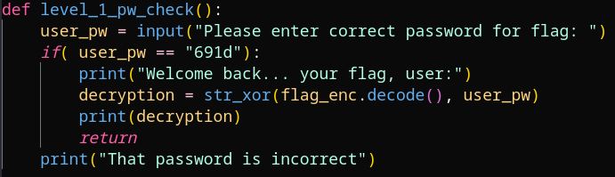

# PW Crack 1

## Description

Can you crack the password to get the flag? 
Download the password checker here and you'll need the 
encrypted flag in the same directory too.

## Prerequisites

Have python installed and have both associated files downloaded.

## Solution

As with most Python scripts I download, I will open them in a code editor of some kind to review what they do before executing. In this case, I was able to immediately see that the password checking function discloses the password in plain text.

I then ran the script via my terminal, entered the password from the function, and the plaintext flag was printed to the screen, solving the problem.