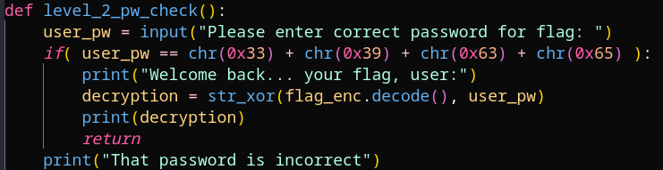

# PW Crack 1

## Description

Can you crack the password to get the flag? 
Download the password checker here and you'll need the 
encrypted flag in the same directory too.

## Prerequisites

Have python installed and have both associated files downloaded.

## Solution

As with most Python scripts I download, I will open them in a code editor of some kind to review what they do before executing. Similar to the problem for Glitch Cat, the password is in an additive formula containing hex characters, surrounding in the char(...) function, and string concatenated together.

As I did in Glitch Cat, I opened an interactive python shell and put the char(...) functions concatenated together inside of a print function. This disclosed the plaintext password, which I then used by executing the level2.py script and entering as the answer. The plaintext flag was printed to the terminal, and the problem was solved.