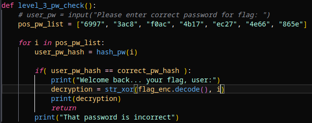

# PW Crack 3

## Description

Can you crack the password to get the flag? 
Download the password checker here and you'll need the encrypted flag and the hash in the same directory too. 
There are 7 potential passwords with 1 being correct. 
You can find these by examining the password checker script.

## Prerequisites

Download the password checker script, the encrypted flag file, and the hash file.

## Solution

When observing the code of level3.py, there is a list at the bottom containing all of the possible passwords. Instead of typing each one in manually, I decided to change the flow of the main function by moving the potential passwords into the function and then interating over the list. This allowed me to run the function over all of the possible passwords and output the flag automatically when the correct one is used. This is extremely feasible given that there are only 7 possibilities.

