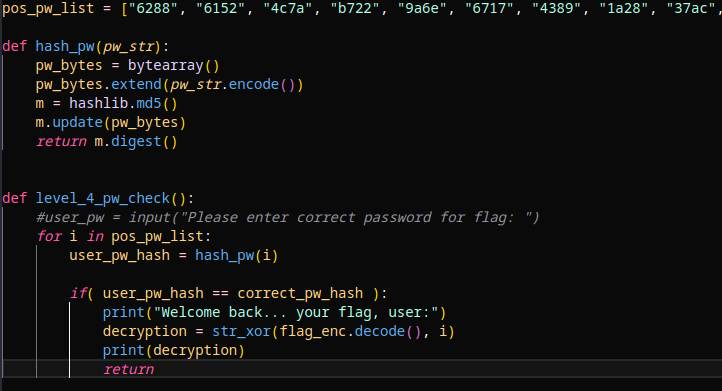

# PW Crack 4

## Description

Can you crack the password to get the flag? 
Download the password checker here and you'll need the encrypted flag and the hash in the same directory too. 
There are 100 potential passwords with only 1 being correct. 
You can find these by examining the password checker script.

## Prerequisites

Download the password checker script, the encrypted flag file, and the hash file.

## Solution

The solution from the last problem can be used here as well; however, I made a couple of modifications to the last solution to fit my needs given that there are 100 possible passwords. To begin, I put the possible password list above the two primary functions, but outside of the main function. I also removed the line that prints an output when an incorrect password is encountered. This cleans up the output of the script and only prints the flag, when found.

