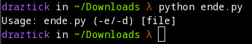
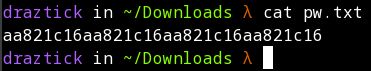
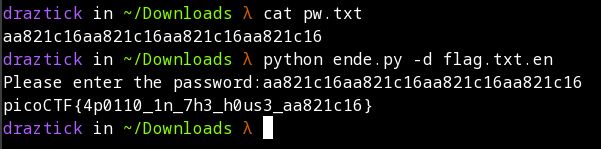

# Python Wrangling

## Description

Python scripts are invoked kind of like programs in the Terminal... Can you run this Python script using this password to get the flag?

## Solution

To begin this exercise, you first need to download the three files from the question: the python file (ende.py), the encrypted flag file (flag.txt.en), and the password file (pw.txt). Once downloaded, we can check a couple of things about the python file to determine if it is self-executable, or if we have to use the python program directly from the terminal.

Python scripts can be executed by first issuing the python command to specify the program used to interpret the file. On most modern Linux distributions, this is done by simply specifying *python* followed by the script name. Issuing this against the ende.py script displays some usage information about the file.



From this output we can infer two things. The -e switch likely means encrypt while the -d switch likely means decrypt. Since the flag file we have is encrypted, we will likely want to use the -d switch to reverse the encryption.

Now, because they include the pw.txt file and specified that it has a password in the description, it likely means we have to input the appropriate password to decrypt the file. This plaintext password can be retrieved by issuing the *cat* command followed by the password file name.



If we put all of this together, we can decrypt the flag by doing the following.

```
python ende.py -d flag.txt.enc
```

A password prompt will appear. You can copy->paste the plaintext password from the pw.txt file into the terminal, and it will output the plaintext flag.

