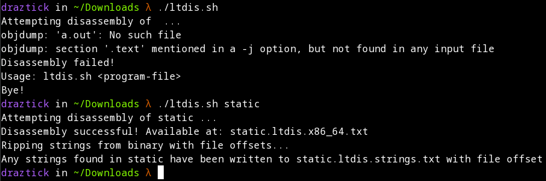
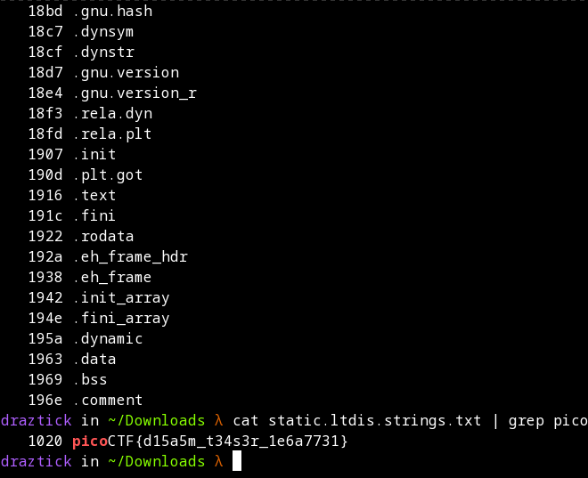

# Static ain't always noise

## Description

Can you look at the data in this binary: static? This BASH script might help!

## Prerequisites

Download the two files associated with this exercise. The first is the binary, called static. The second is the bash script called ltdis.sh.

## Solution

The description gives a hint that the bash script is going to be the primary factor in solving this problem. I began by changing the permissions of the bash script to include execute permissions by issuing a *chmod u+x static* command.

This allows me to use dot slash notation to execute the script, whose output shows me a bit about the usage of the script. It requires a file, preferably a binary, as an argument. I then issue the command *./ltdis.sh static* which informs that a file has been created with all of the valid strings found in the binary file.

From here, I know I can *cat* the file out to the terminal, but this returns way too much data. Since I know that the flag format begins with "pico", I just send standard output from the *cat* command into *grep* searching for the word pico. What is returned is the plaintext flag we want.

