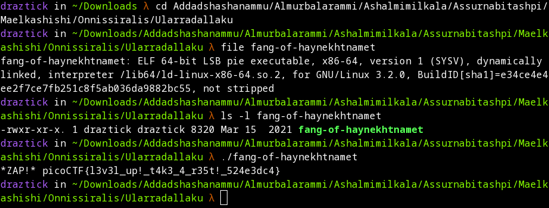

# Tab, Tab, Attack

## Description
Using tabcomplete in the Terminal will add years to your life, esp. when dealing with long rambling directory structures and filenames: Addadshashanammu.zip

## Prerequisites

Download the provided zip archive.

## Solution

Probably one of the easiest problems so far, beginning by having me unzip the zip archive using the *unzip* utility.

```
unzip Addadshashanammu.zip
```

Once complete, this revealed a directory structure with a bunch of long, crazy names. Going along with the hints the name and description gave me, I began pressing Tab after typing one to some letters of the name. Once I get to the end and see a file instead of a directory, I then issued a *file* command to determine what kind of file I was working with. This showed me that the file is an ELF executable. Knowing this, I issue the *ls -l* command on the file to determine if execute permissions are already set. Thankfully, they are. I then use dot slash notation to execute the binary file, which reveals the plaintext flag.

