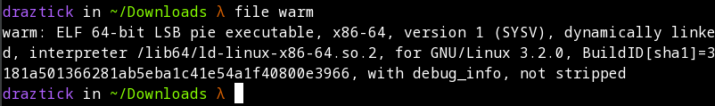
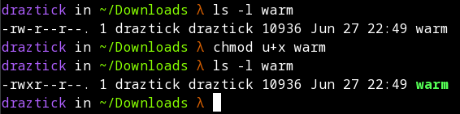
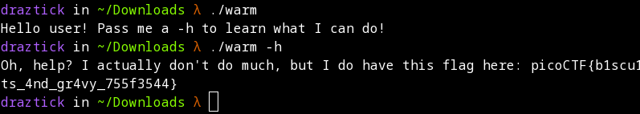

# Wave a flag

## Description

Can you invoke help flags for a tool or binary? This program has extraordinarily helpful information...

## Solution

To begin this exercise, we first need to download the program specified in the description. This downloads a file called warm.

To find out the type of file that warm is, we can issue a *file* command.

```
file warm
```



From this output we can see that the file is a 64-bit ELF file, meaning it is an executable. To do so, we need to make sure it has execute permissions for the current user. This can be checked by issuing a *ls* command with an -l switch to specify the list format and the file name to show only that file. To the left of the terminal you will likely see some dashes and a handful of letters (r's and w's). This gives you the current permission level. 

We want to ensure that the current user has the permissions to execute the file. We can accomplish this by issuing a *chmod* command followed by u+x, specifying that we want to give the owner of the file executable permissions, and then the name of the file. We can check that the permissions took by reissuing the same ls command and checking that an x was added to the right of the first rw.



NOTE: If you have issues, make sure that your current user is set as the owner of the file. In the screenshot above, this is the first *draztick*. If set to *root*, you will have to either change the permissions or prefix all of the commands with *sudo*.

Once execute permissions have been set, we can execute the file by using the following syntax:

```
./warm
```

Once executed, the program asks us to pass a -h switch as an argument to learn what it does.

```
./warm -h
```

This output returns a message and a plaintext flag.

