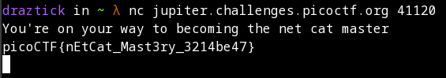

# what's a net cat

## Description

Using netcat (nc) is going to be pretty important. Can you connect to jupiter.challenges.picoctf.org at port 41120 to get the flag?

## Prerequisites

Install netcat or Nmap's ncat utility.

## Solution

This flag was pretty easy to find. You simply need to connect to the specified server over the specified port and the flag is immediately revealed.

